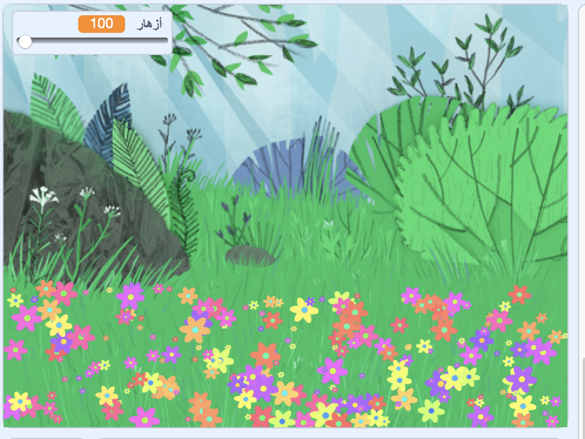

## المقدمة

In this project you will create a peaceful, flower-strewn meadow, to gaze at, relax and chill.

### ما الذي سوف تصنعه

--- no-print ---

انقر فوق العلم الأخضر ثم قم بنقل شريط التمرير لضبط عدد الزهور.

<iframe src="https://scratch.mit.edu/projects/392040712/embed" allowtransparency="true" width="485" height="402" frameborder="0" scrolling="no" allowfullscreen></iframe>

--- /no-print ---

--- print-only ---

--- /print-only ---

--- collapse ---
---
title: ما ستحتاج إليه
---

### الأجهزة

- جهاز الكمبيوتر

### البرامج

+ برنامج Scratch 3 (سواء كان [متصل بالإنترنت](http://rpf.io/scratchon) أو [دون إتصال بالإنترنت](http://rpf.io/scratchoff))

--- /collapse ---

--- collapse ---
---
title: ما الذي سوف تتعلمه
---

- كيفية استخدام أرقام عشوائية في مشاريعك

--- /collapse ---

--- collapse ---
---
title: معلومات إضافية للمعلمين
---

إذا كنت بحاجة إلى طباعة هذا المشروع ، فالرجاء استخدام الإصدار [الملائم للطابعة](https://projects.raspberrypi.org/en/projects/mindful-meadow/print){:target="_blank"}.

[إليك رابط إلى مصادر هذا المشروع](http://rpf.io/p/en/mindful-meadow-get).

--- /collapse ---
