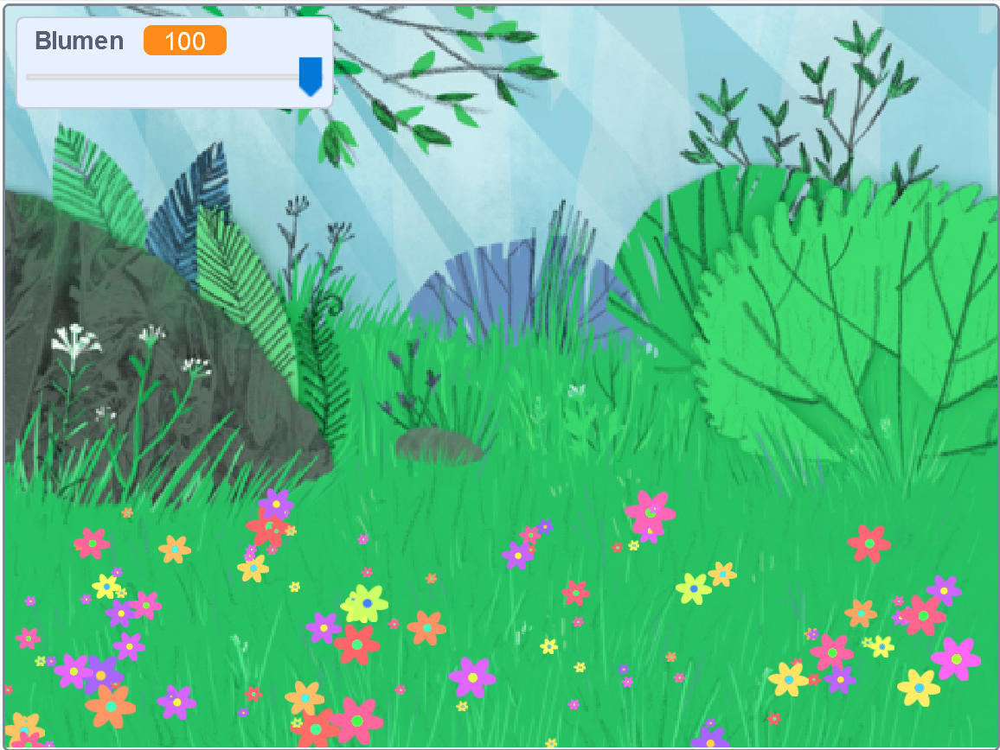

## Einleitung

In diesem Projekt erstellst du eine friedliche, mit Blumen übersäte Wiese, die du dir ansehen, dich ausruhen und entspannen kannst.

### Was du machen wirst

--- no-print ---

Klicke auf die grüne Flagge und bewege den Schieberegler, um die Anzahl der Blumen anzupassen.

<iframe src="https://scratch.mit.edu/projects/392040712/embed" allowtransparency="true" width="485" height="402" frameborder="0" scrolling="no" allowfullscreen></iframe>

--- /no-print ---

--- print-only ---

--- /print-only ---

--- collapse ---
---
title: Was du brauchen wirst
---

### Hardware

- Einen Computer

### Software

+ Scratch 3 (entweder [online](http://rpf.io/scratchon) oder [offline](http://rpf.io/scratchoff))

--- /collapse ---

--- collapse ---
---
title: Was du lernen wirst
---

- Wie du Zufallszahlen in deinen Projekten verwenden kannst

--- /collapse ---

--- collapse ---
---
title: Zusätzliche Informationen für Pädagogen
---

Wenn du dieses Projekt ausdrucken möchtest, verwende die [druckerfreundliche Version](https://projects.raspberrypi.org/en/projects/mindful-meadow/print){:target="_blank"}.

[Hier ist ein Link zu den Ressourcen für dieses Projekt](http://rpf.io/p/en/mindful-meadow-get).

--- /collapse ---
