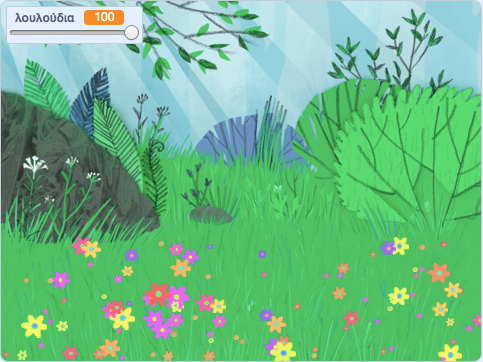

## Εισαγωγή

Σε αυτό το έργο θα δημιουργήσεις ένα γαλήνιο, ανθισμένο λιβάδι, για να το χαζέψεις, να αράξεις και να χαλαρώσεις.

### Τι θα φτιάξεις

--- no-print ---

Κάνε κλικ στην πράσινη σημαία και, στη συνέχεια, μετακίνησε την κυλιόμενη μπάρα για να προσαρμόσεις τον αριθμό των λουλουδιών.

<iframe src="https://scratch.mit.edu/projects/394003365/embed" allowtransparency="true" width="485" height="402" frameborder="0" scrolling="no" allowfullscreen></iframe>

--- /no-print ---

--- print-only ---

--- /print-only ---

--- collapse ---
---
title: Τι θα χρειαστείς
---

### Υλικό

- Έναν υπολογιστή

### Λογισμικό

+ Scratch 3 (είτε [σε σύνδεση](http://rpf.io/scratchon) είτε [εκτός σύνδεσης](http://rpf.io/scratchoff))

--- /collapse ---

--- collapse ---
---
title: Τι θα μάθεις
---

- Πώς να χρησιμοποιείς τυχαίους αριθμούς στα έργα σου

--- /collapse ---

--- collapse ---
---
title: Πρόσθετες πληροφορίες για εκπαιδευτικούς
---

Αν χρειαστεί να εκτυπώσεις αυτό το έργο, χρησιμοποίησε την [εκτυπώσιμη έκδοση](https://projects.raspberrypi.org/el-GR/projects/mindful-meadow/print){:target="_blank"}.

[Ακολουθεί ένας σύνδεσμος για τους πόρους για το έργο αυτό](http://rpf.io/p/el-GR/mindful-meadow-get).

--- /collapse ---
