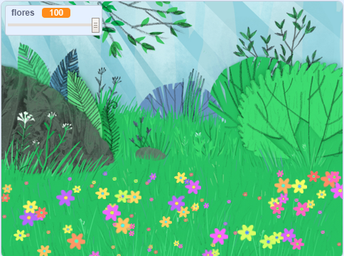

## Introducción

In this project you will create a peaceful, flower-strewn meadow, for you to gaze at, relax, and chill.

### Lo que harás

--- no-print ---

Haz clic en la bandera verde y luego mueve el control deslizante para ajustar el número de flores.

<iframe src="https://scratch.mit.edu/projects/392040712/embed" allowtransparency="true" width="485" height="402" frameborder="0" scrolling="no" allowfullscreen></iframe>

--- /no-print ---

--- print-only ---

--- /print-only ---

--- collapse ---
---
title: Lo que necesitarás
---

### Hardware

- Un ordenador

### Software

+ Scratch 3 (ya sea [en línea](http://rpf.io/scratchon) o [sin conexión](http://rpf.io/scratchoff))

--- /collapse ---

--- collapse ---
---
title: Lo que vas a aprender
---

- Cómo usar números aleatorios en tus proyectos

--- /collapse ---

--- collapse ---
---
title: Información adicional para educadores
---

Si necesitas imprimir este proyecto, por favor usa la [versión para imprimir](https://projects.raspberrypi.org/en/projects/mindful-meadow/print){:target="_blank"}.

[Aquí hay un enlace a los recursos para este proyecto](http://rpf.io/p/en/mindful-meadow-get).

--- /collapse ---
