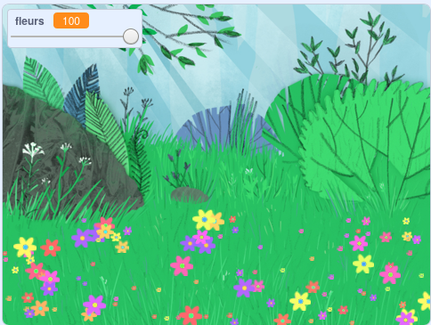

## Introduction

Dans ce projet, tu créeras une prairie paisible et fleurie pour contempler, te relaxer et te détendre.

### Ce que tu feras

--- no-print ---

Clique sur le drapeau vert, puis déplace le curseur pour ajuster le nombre de fleurs.

<iframe src="https://scratch.mit.edu/projects/392824824/embed" allowtransparency="true" width="485" height="402" frameborder="0" scrolling="no" allowfullscreen></iframe>

--- /no-print ---

--- print-only ---

--- /print-only ---

--- collapse ---
---
title: Ce qu'il te faut
---

### Matériel informatique

- Un ordinateur

### Logiciel

+ Scratch 3 (soit [en ligne](https://rpf.io/scratchon) soit [hors-ligne](https://rpf.io/scratchoff))

--- /collapse ---

--- collapse ---
---
title: Ce que tu vas apprendre
---

- Comment utiliser des nombres aléatoires dans tes projets

--- /collapse ---

--- collapse ---
---
title: Informations supplémentaires pour les éducateurs
---

Si vous avez besoin d'imprimer ce projet, utilisez la [version imprimable.](https://projects.raspberrypi.org/fr-FR/projects/mindful-meadow/print){:target="_blank"}.

[Voici un lien vers les ressources de ce projet](https://rpf.io/p/fr-FR/mindful-meadow-get).

--- /collapse ---
