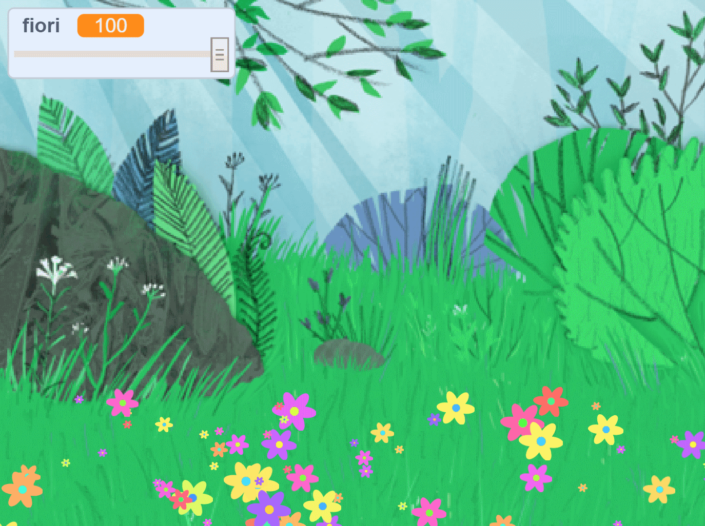

## Introduzione

In this project you will create a peaceful, flower-strewn meadow, for you to gaze at, relax, and chill.

### Che cosa creerai

--- no-print ---

Click the green flag and then move the slider to adjust the number of flowers.

<iframe src="https://scratch.mit.edu/projects/392040712/embed" allowtransparency="true" width="485" height="402" frameborder="0" scrolling="no" allowfullscreen></iframe>

--- /no-print ---

--- print-only ---

--- /print-only ---

--- collapse ---
---
title: Cosa ti servirà
---

### Hardware

- Un computer

### Software

+ Scratch 3 ([online](http://rpf.io/scratchon) o [offline](http://rpf.io/scratchoff))

--- /collapse ---

--- collapse ---
---
title: What you will learn
---

- How to use random numbers in your projects

--- /collapse ---

--- collapse ---
---
title: Informazioni aggiuntive per gli educatori
---

If you need to print this project, please use the [printer-friendly version](https://projects.raspberrypi.org/en/projects/mindful-meadow/print){:target="_blank"}.

[Ecco un link alle risorse per questo progetto](http://rpf.io/p/en/mindful-meadow-get).

--- /collapse ---
