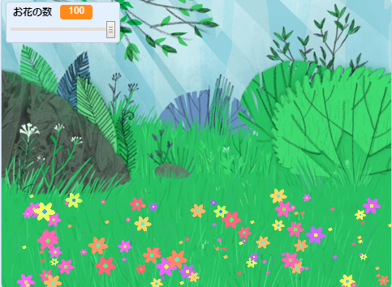

## はじめに

このプロジェクトでは、見ていると心が安らぐ、花がさく草原を作ります。

### 作るもの

--- no-print ---

緑の旗 (はた) をクリックし、スライダーを動かしてお花の数を調整します。

<iframe src="https://scratch.mit.edu/projects/393999403/embed" allowtransparency="true" width="485" height="402" frameborder="0" scrolling="no" allowfullscreen></iframe>

--- /no-print ---

--- print-only ---

--- /print-only ---

--- collapse ---
---
title: 必要 (ひつよう) なもの
---

### ハードウェア

- コンピューター

### ソフトウェア

+ Scratch 3 ([オンライン](http://rpf.io/scratchon)または[オフライン](http://rpf.io/scratchoff))

--- /collapse ---

--- collapse ---
---
title: 学ぶこと
---

- プロジェクトで乱数 (らんすう) を使用する方法

--- /collapse ---

--- collapse ---
---
title: 教育者向けの追加情報
---

このプロジェクトを印刷する必要がある場合は、 [印刷用バージョン](https://projects.raspberrypi.org/ja-JP/projects/mindful-meadow/print){:target="_ blank"}を使用してください。

[このプロジェクトのリソースへのリンクはこちらです](http://rpf.io/p/ja-JP/mindful-meadow-get) 。

--- /collapse ---
