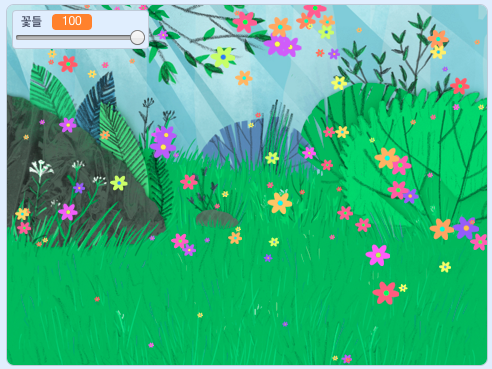

## 들어가며

In this project you will create a peaceful, flower-strewn meadow, for you to gaze at, relax, and chill.

### 당신이 만들 작품

--- no-print ---

초록색 깃발을 클릭한 뒤, 꽃들의 수를 바꾸기 위해 슬라이더로 이동하세요.

<iframe src="https://scratch.mit.edu/projects/392040712/embed" allowtransparency="true" width="485" height="402" frameborder="0" scrolling="no" allowfullscreen></iframe>

--- /no-print ---

--- print-only ---

--- /print-only ---

--- collapse ---
---
title: 준비물
---

### 하드웨어

- 컴퓨터

### 소프트웨어

+ 스크래치 3 ([온라인](http://rpf.io/scratchon) 또는 [오프라인](http://rpf.io/scratchoff))

--- /collapse ---

--- collapse ---
---
title: 학습 목표
---

- 프로젝트에서 난수를 사용하는 방법

--- /collapse ---

--- collapse ---
---
title: 교육자를 위한 추가 정보
---

이 프로젝트를 인쇄하려면, [프린트용 버전](https://projects.raspberrypi.org/en/projects/mindful-meadow/print){:target="_blank"}을 사용하십시오.

[이곳은 프로젝트에 필요한 자료를 얻을 수 있는 링크입니다.](http://rpf.io/p/en/mindful-meadow-get)

--- /collapse ---
