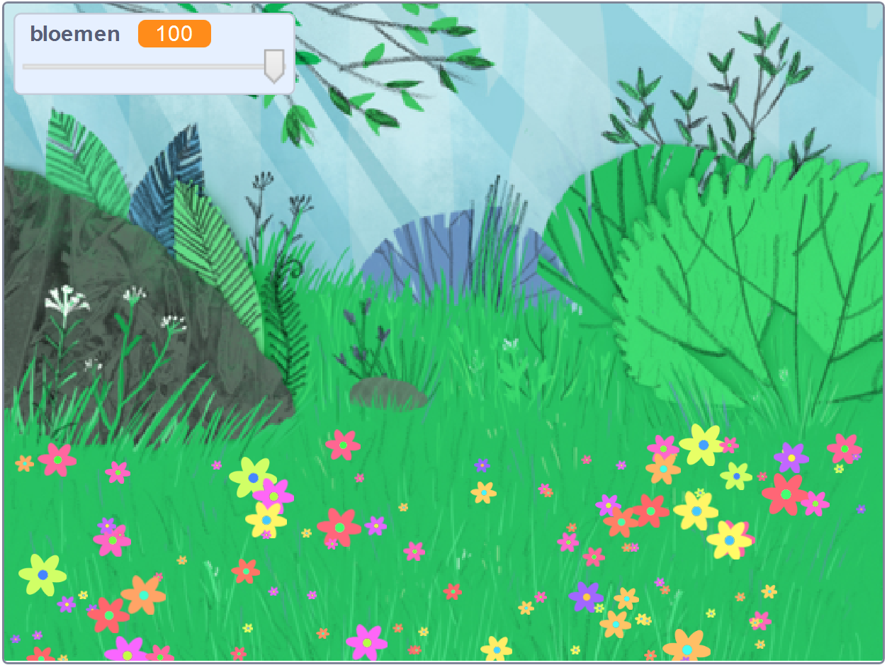

## Inleiding

In this project you will create a peaceful, flower-strewn meadow, to gaze at, relax and chill.

### Wat ga je maken

--- no-print ---

Klik op de groene vlag en verplaats de schuifregelaar om het aantal bloemen aan te passen.

<iframe src="https://scratch.mit.edu/projects/392040712/embed" allowtransparency="true" width="485" height="402" frameborder="0" scrolling="no" allowfullscreen></iframe>

--- /no-print ---

--- print-only ---

--- /print-only ---

--- collapse ---
---
title: Wat heb je nodig
---

### Hardware

- Een computer

### Software

+ Scratch 3 (of [online](http://rpf.io/scratchon) of [offline](http://rpf.io/scratchoff))

--- /collapse ---

--- collapse ---
---
title: Wat ga je leren
---

- Hoe je willekeurige getallen gebruikt in je projecten

--- /collapse ---

--- collapse ---
---
title: Aanvullende informatie voor docenten
---

Als je dit project wilt afdrukken, gebruik dan de [printvriendelijke versie](https://projects.raspberrypi.org/en/projects/mindful-meadow/print){:target="_blank"}.

[ Hier is een link naar de bronnen voor dit project ](http://rpf.io/p/en/mindful-meadow-get).

--- /collapse ---
