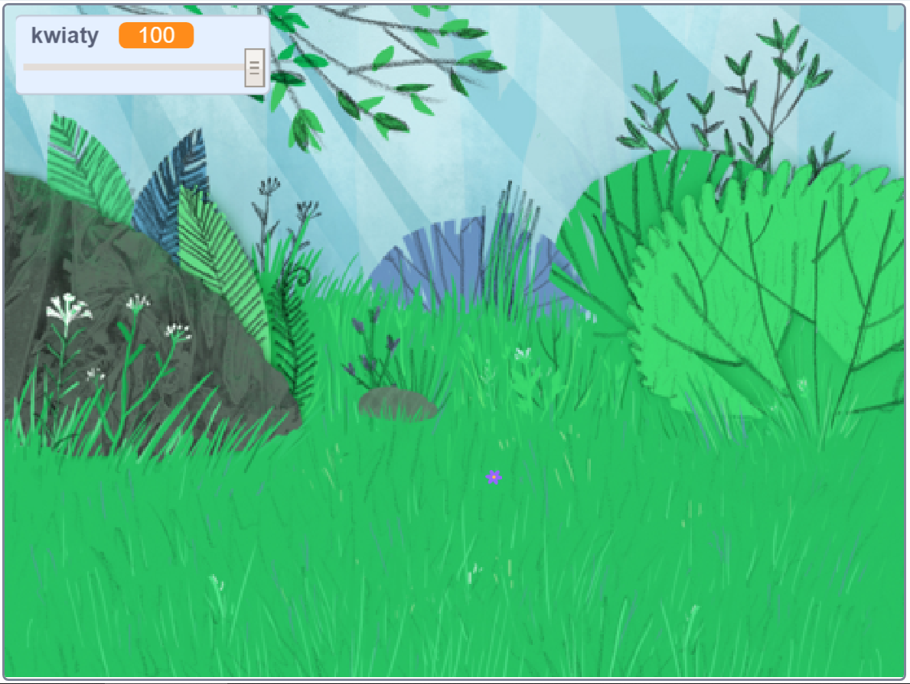

## Wprowadzenie

W tym projekcie stworzysz spokojną, porośniętą kwiatami łąkę, patrząc na którą będziesz mogła relaksować się i odpocząć.

### Co stworzysz

--- no-print ---

Kliknij zieloną flagę, a następnie przesuń suwak, aby ustawić liczbę kwiatów.

<iframe src="https://scratch.mit.edu/projects/392040712/embed" allowtransparency="true" width="485" height="402" frameborder="0" scrolling="no" allowfullscreen></iframe>

--- /no-print ---

--- print-only ---

--- /print-only ---

--- collapse ---
---
title: Czego będziesz potrzebować
---

### Sprzęt

- Komputer

### Oprogramowanie

+ Scratch 3 ([online](http://rpf.io/scratchon) lub [offline](http://rpf.io/scratchoff))

--- /collapse ---

--- collapse ---
---
title: Czego się nauczysz
---

- Jak używać liczb losowych w swoich projektach

--- /collapse ---

--- collapse ---
---
title: Dodatkowe informacje dla nauczycieli
---

Jeśli chcesz wydrukować ten projekt, użyj [wersji do druku](https://projects.raspberrypi.org/en/projects/mindful-meadow/print){:target="_blank"}.

[Oto link do zasobów dla tego projektu](http://rpf.io/p/en/mindful-meadow-get).

--- /collapse ---
