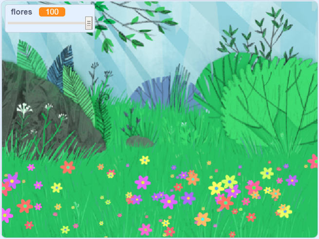

## Introdução

In this project you will create a peaceful, flower-strewn meadow, to gaze at, relax and chill.

### O que você vai fazer

--- no-print ---

Clique na bandeira verde e mova o controle deslizante para ajustar o número de flores.

<iframe src="https://scratch.mit.edu/projects/392040712/embed" allowtransparency="true" width="485" height="402" frameborder="0" scrolling="no" allowfullscreen></iframe>

--- /no-print ---

--- print-only ---

--- /print-only ---

--- collapse ---
---
title: What you will need
---

### Hardware

- Um computador

### Software

+ Scratch 3 (either [online](http://rpf.io/scratchon) or [offline](http://rpf.io/scratchoff))

--- /collapse ---

--- collapse ---
---
title: What you will learn
---

- Como usar números aleatórios em seus projetos

--- /collapse ---

--- collapse ---
---
title: Additional information for educators
---

If you need to print this project, please use the [printer-friendly version](https://projects.raspberrypi.org/en/projects/mindful-meadow/print){:target="_blank"}.

[Here is a link to the resources for this project](http://rpf.io/p/en/mindful-meadow-get).

--- /collapse ---
