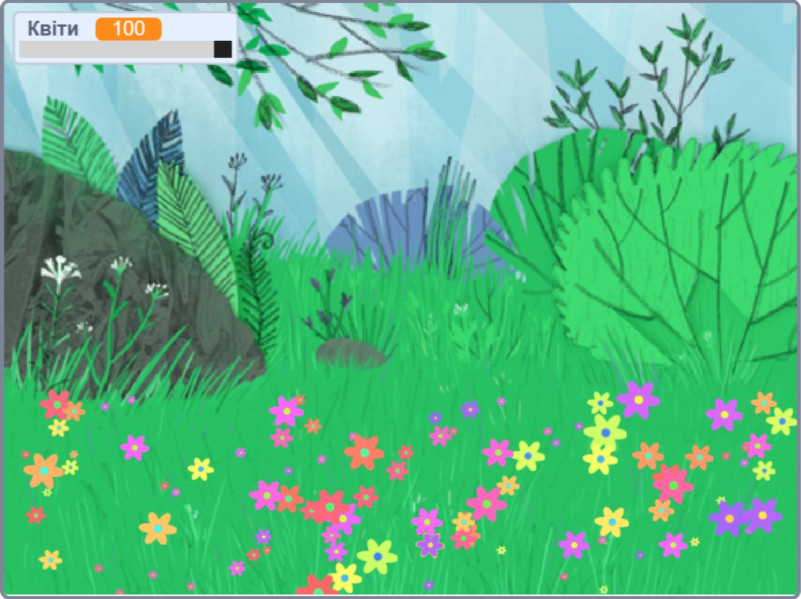

## Вступ

In this project you will create a peaceful, flower-strewn meadow, for you to gaze at, relax, and chill.

### Що ти зробиш

--- no-print ---

Натисни на зелений прапорець, а потім перетягни повзунок, щоб відрегулювати кількість квітів.

<iframe src="https://scratch.mit.edu/projects/392040712/embed" allowtransparency="true" width="485" height="402" frameborder="0" scrolling="no" allowfullscreen></iframe>

--- /no-print ---

--- print-only ---

--- /print-only ---

--- collapse ---
---
title: Що тобі знадобиться
---

### Обладнання

- Комп'ютер

### Програмне забезпечення

+ Скретч 3 ([онлайн](http://rpf.io/scratchon) або [офлайн](http://rpf.io/scratchoff))

--- /collapse ---

--- collapse ---
---
title: Чого ти навчишся
---

- Як використовувати випадкові числа у своїх проєктах

--- /collapse ---

--- collapse ---
---
title: Додаткова інформація для викладачів
---

Якщо вам потрібно роздрукувати цей проєкт, будь ласка, скористайтеся [версією для друку](https://projects.raspberrypi.org/en/projects/mindful-meadow/print) {:target="_ blank"}.

[Ось посилання на ресурси для цього проєкту](http://rpf.io/p/en/mindful-meadow-get).

--- /collapse ---
