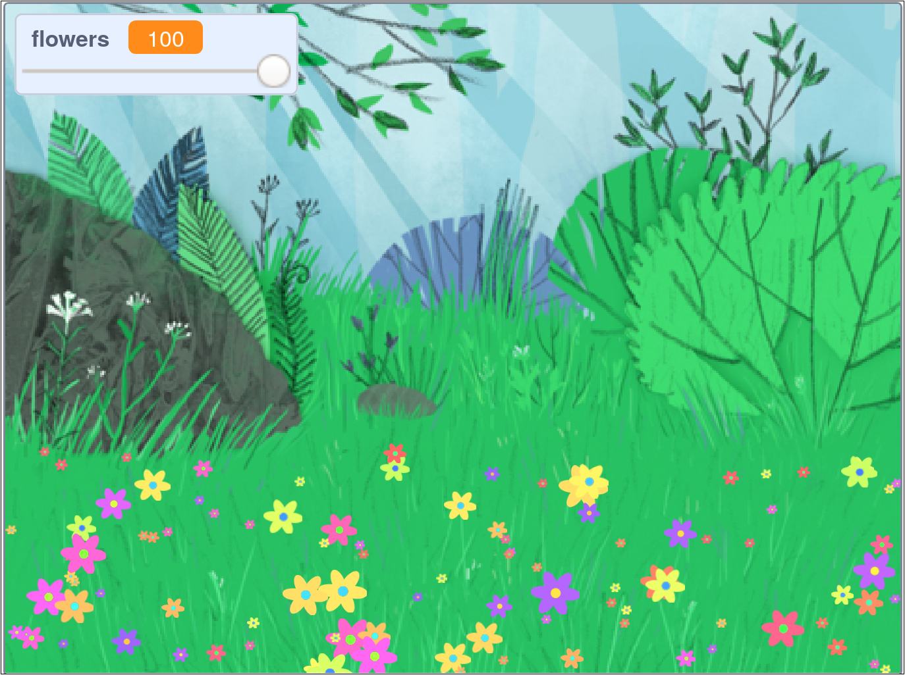

## 介紹

In this project you will create a peaceful, flower-strewn meadow, for you to gaze at, relax, and chill.

### 你將會做出

--- no-print ---

點擊綠色旗子，然後移動滑桿來調整花朵數量。

<iframe src="https://scratch.mit.edu/projects/392040712/embed" allowtransparency="true" width="485" height="402" frameborder="0" scrolling="no" allowfullscreen></iframe>

--- /no-print ---

--- print-only ---

--- /print-only ---

--- collapse ---
---
title: 你會需要用到
---

### 硬體

- 一台電腦

### 軟體

+ Scratch 3（[線上版](http://rpf.io/scratchon)或[離線版](http://rpf.io/scratchoff)）

--- /collapse ---

--- collapse ---
---
title: 你會學到
---

- 如何在項目中使用隨機數

--- /collapse ---

--- collapse ---
---
title: 給教師的其它資訊
---

如果你需要列印此專案，請使用[友善列印](https://projects.raspberrypi.org/en/projects/mindful-meadow/print){:target="_blank"}。

[這裡是是本專案的資源連結。](http://rpf.io/p/en/mindful-meadow-get) 。

--- /collapse ---
